# Автоматики

Status: In progress

# Билет 1

in progress

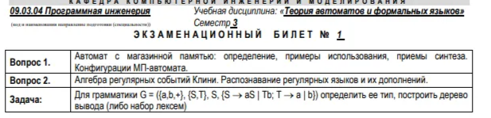

## Вопрос 1

Конечный автомат, использующий дополнительную память (ленту), называют автоматом с магазинной памятью (МП-автоматом)

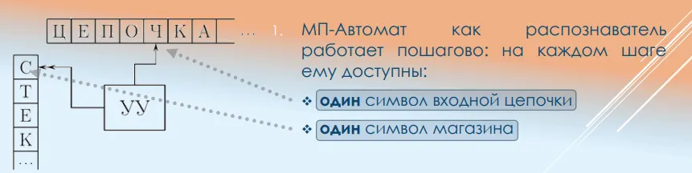

Пример использования

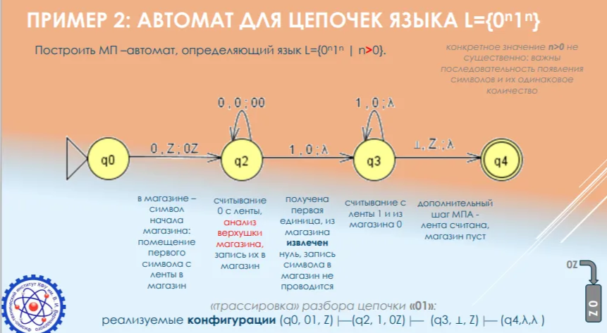

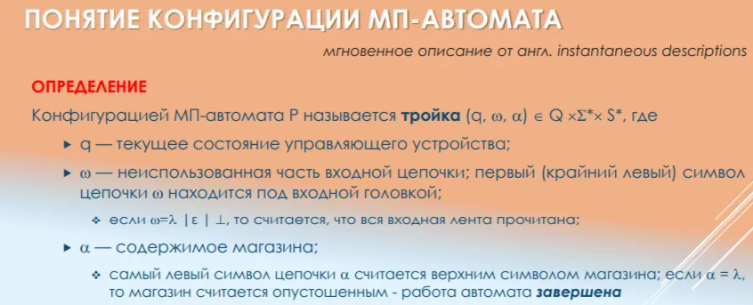

#TODO: Синтез МП-автоматов?

## Вопрос 2

### АЛГЕБРА РЕГУЛЯРНЫХ СОБЫТИЙ. РЕГУЛЯРНЫЕ ВЫРАЖЕНИЯ

ОПРЕДЕЛЕНИЕ 1: Алгебра регулярных событий – замкнутая алгебраическая система, определенная для подмножеств, элементами которых служат цепочки в некотором алфавите, называемые элементарными событиями
ОПРЕДЕЛЕНИЕ 2: Класс множеств цепочек, которые описываются алгеброй событий, называются регулярным
ОПРЕДЕЛЕНИЕ 3: Регулярные выражения – конструктивное средство, точно задающее любые регулярные события с использованием конечного числа операций

### ЗАМКНУТОСТЬ РЕГУЛЯРНЫХ ЯЗЫКОВ

Свойство замкнутости означает, что все операции алгебры регулярных событий над регулярными множествами дают регулярное множество.
Если автомат задает (представляет) некоторое множество цепочек, то алгебра событий позволяет вычислить любой элемент этого множества (грамматики это тоже «умеют»)

### РЕГУЛЯРНЫЕ МНОЖЕСТВА

Регулярные выражения – конструктивное средство, оперирующее регулярными множествами и точно задающее все обусловленные им события
Регулярные множества (события) построены на основе элементарных регулярных событий, определенных для некоторого алфавита Z из следующих трех констант:

- символ алфавита a ∈ 𝑍, обозначающий сам себя (литерал, терминал)
- пустая цепочка ε ( или λ – в системе JFLAP )
- пустое множество ø
а также множества, состоящего из символов алфавита и множеств

### ОПЕРАЦИИ ДЛЯ РЕГУЛЯРНЫХ МНОЖЕСТВ

В алгебре событий определены три операции :

- Дизъюнкция (чередование) α | β или α + β, реже α V β. Множество цепочек {α, β}, где α∈A, β ∈ B A, B – регулярные множества
- *Конкатенация (сцепление) α β (избегают указания символов «», « & » и « . »). Множество цепочек вида {αβ}, где α∈A, β∈B A, B – регулярные множества*
- *Итерация (замыкание, звезда Клини) α или {a}, или {a}. транзитивное множество цепочек, полученных сцеплением {ε, α, αα, ααα….}, где α∈A A – регулярное множество*

### ТЕОРЕМА КЛИНИ

Классы регулярных множеств и автоматных языков совпадают
ОПРЕДЕЛЕНИЕ Событием в автомате называют любое регулярное подмножество над алфавитом Z
СЛЕДСТВИЕ 1: Любые регулярные события, причем только они, представимы в конечных автоматах
СЛЕДСТВИЕ 2: Всякую систему переходов в конечном автомате можно задать регулярным событием

TODO: Распознавание регулярных языков и их дополнений. Наверное тут реч про построение автоматов по регулярному языку, но ээээээээээээээээээээээ пока хз.

## Задача

#TODO: Надо ее поправить

# Билет 2

in progress

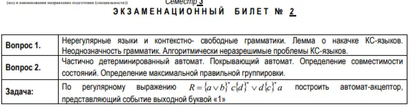

## Вопрос 1

### Нерегулярные и контекстно-свободные грамматики

TODO: Сделать более структурировано и по делу

Нерегулярные языки - языки 0, 1, 2 типа.

Тип 0 – неограниченные грамматики (рекурсивно-перечислимые языки)
- не установлено никаких ограничений на правила грамматики (правила
продукции), кроме наличия хотя бы одного нетерминала в левой части правил
продукции; это грамматики с фразовой структурой
- любой язык с грамматикой типа 0 является рекурсивно перечислимым
множеством, любое рекурсивно перечислимое множество определяется
грамматикой типа 0

Тип 1 – контекстно-зависимые неукорачивающие грамматики

как и во всех грамматиках, в правилах вывода слева
должен присутствовать хотя бы один нетерминальный символ;
- левая и правая часть правил продукции могут содержать любые цепочки из
терминалов и нетерминалов αAβ→αγβ, где α, β произвольные цепочки, γ - непустая
цепочка, A - нетерминал, с условием |αAβ|≤|αγβ|
- любой нетерминальный символ А может быть раскрыт в зависимости от окружения
(контекста α,β ) по-разному; сам контекст не меняется, и может быть пустым
- иначе говоря, грамматики 1 типа – неукорачивающие, в любой неукорачивающей грамматике допускается наличие правила S→ε, при условии: S - начальный символ, который не встречается в правых частях правил
- для прерывания рекурсии допустимо терминальное правило A→$ правила грамматики можно привести к виду α→β, где α, β непустые цепочки с
условием 1≤|α|≤|β|

### ЛЕММА КЛИНИ О РАЗРАСТАНИИ (НАКАЧКЕ) ДЛЯ АВТОМАТНЫХ ЯЗЫКОВ

Для бесконечного автоматного языка L над алфавитом Z существует такое натуральное число n, что для любого слова ω ∈ 𝐿 ⊆ 𝑍 ∗ длины не меньше n найдутся слова α,β,δ ∈ 𝑍 ∗ , такие, что их конкатенация ω=αβδ, где αβ ≤ 𝑛, δ ≥ 1 является словом языка L и для всякого неотрицательного целого i цепочка αβ iδ также является словом языка L.

### НЕОДНОЗНАЧНОСТЬ ГРАММАТИК

- в фразах «прямо направо», «прямо и направо», «прямо-прямо» смысл слова «прямо»
раскрывается в зависимости от контекста по-разному
• неоднозначность толкования «казнить нельзя помиловать» без контекста;

TODO: Сыровато написано

### АЛГОРИТМИЧЕСКАЯ РАЗРЕШИМОСТЬ/НЕРАЗРЕШИМОСТЬ

Имеются формальные языки с грамматикой типа 0, для которых проверка цепочки на предмет принадлежности языку алгоритмически неразрешима
Задача напрямую связана с неразрешимостью проблемы останова машины; языки Lhalt/Lu - в
теории вычислимости демонстрируют фундаментальные ограничения алгоритмов.

КС-языки могут алгоритмически точно распознаны автоматом с дополнительной памятью (магазин, буфер, стек, лента); это Р-задача, решаемая за разумное время.

## Вопрос 2

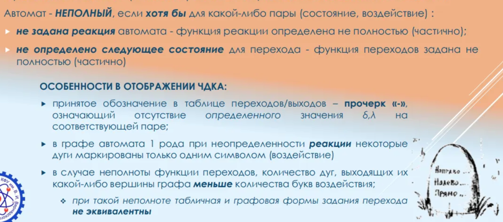

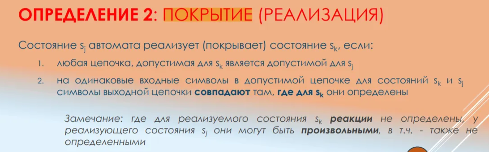

Примеч: не нашел определения покрывающего автомата, но по сути любая правильная замкнутая группировка автомата = автомат, покрывающий исходный автомат

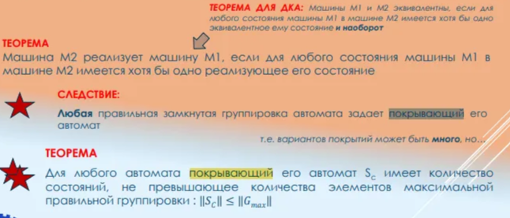

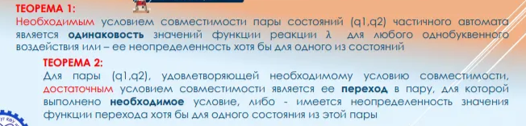

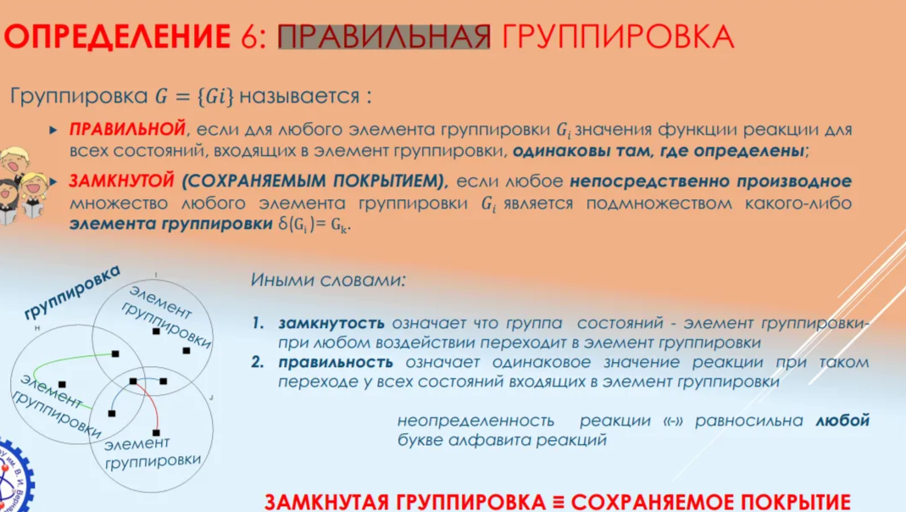

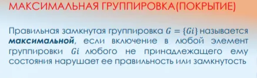

## Задача

TODO: КАКОЙ ЕЩЕ НАХУЙ АВТОМАТ АКЦЕПТОР, НУ Я ЧТО ТО ПОПЫТАЛСЯ ПОПУКАТЬ МБ ПОТОМ ПОПРОШУ ФАКТ ЧЕК ОТ ПАРМЕНОВА

сначала e-nka

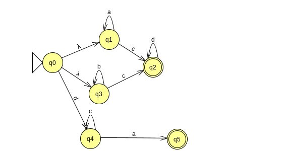

по нему nka

по нему автомат Мура(Хотя можно было бы и Мили)

# Билет 3

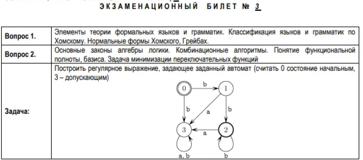

## Вопрос 1

### ТИПЫ ГРАММАТИК

Тип 0 – неограниченные грамматики (рекурсивно-перечислимые языки)

- не установлено никаких ограничений на правила грамматики (правила продукции), кроме наличия хотя бы одного нетерминала в левой части правил продукции; это грамматики с фразовой структурой
- любой язык с грамматикой типа 0 является рекурсивно перечислимым множеством, любое рекурсивно перечислимое множество определяется грамматикой типа 0
Тип 1 – контекстно-зависимые неукорачивающие грамматики
- как и во всех грамматиках, в правилах вывода слева должен присутствовать хотя бы один нетерминальный символ;
- левая и правая часть правил продукции могут содержать любые цепочки из терминалов и нетерминалов αAβ→αγβ, где α, β произвольные цепочки, γ - непустая цепочка, A - нетерминал, с условием |αAβ|≤|αγβ|
- любой нетерминальный символ А может быть раскрыт в зависимости от окружения (контекста α,β ) по-разному; сам контекст не меняется, и может быть пустым
❖ иначе говоря, грамматики 1 типа – неукорачивающие
❖ в любой неукорачивающей грамматике допускается наличие правила S→ε, при условии: S - начальный символ, который не встречается в правых частях правил
❖ для прерывания рекурсии допустимо терминальное правило A→$  правила грамматики можно привести к виду α→β, где α, β непустые цепочки с условием 1≤|α|≤|β|
- правила грамматики можно привести к виду α→β, где α, β непустые цепочки с условием 1≤|α|≤|β|
Тип 2 – контекстно-свободные (бесконтекстные) грамматики
любой нетерминальный символ может быть раскрыт вне зависимости от окружения (контекста);
- значение не определяется контекстом, поэтому язык проще -
- ограничения для правил грамматики относятся к левой части правил продукции: A→β, где A единственный нетерминал, β – любая цепочка терминалов и нетерминалов
- нетерминал слева может быть заменен любым словом, составленным из полного словаря o A→‘ПРИВЕТ’|A +’,’+ A в нотации C#
- если в правой части не более одного нетерминала – грамматика линейная
- в правой части правил допускается пустая цепочка
Тип 3 – регулярные грамматики
являются частным случаем линейных КС-грамматик
- имеют дополнительные ограничения на правую часть правил продукции:
❖ в правой части продукции присутствует единственный терминальный символ или…
❖ возможно добавление к нему слева или справа единственного нетерминала:
- частный случай линейной КС слева – один, а справа – не более одного нетерминала;
- праволинейные грамматики с правилами A→γB алгоритмически всегда можно привести к виду A→Сγ с левосторонними правилами, и наоборот (эквивалентность)
- допускают пустую строку в правой части продукции (укорачивающая грамматика), алгоритмически всегда могут быть приведены к неукорачивающей грамматике
- праволинейная неукорачивающая регулярная грамматика называется автоматной

### НОРМАЛЬНЫЕ ФОРМЫ

КС-грамматика находится в **нормальной форме Хомского (CNF)**, если все её продукции имеют вид:
A→ВС или А→а или S→ε,
Где A, B, C – нетерминалы, B и C не могут являться начальными символами, S – начальный символ, а – терминальный символ, ε – пустая строка.
КС-грамматика находится в нормальной **форме Грейбах (GNF)**, если любая продукция данной грамматики имеет следующий вид:
A→aС,
Где A– нетерминал, а– обязательный в левой части правила начальный терминальный символ, С – любая цепочка из терминалов и нетерминалов

## Вопрос 2

TODO: ВОТ БЫ ЭТОГО ВОПРОСА НЕ БЫЛО

## Задача

(b|bbb*a)(a*|b*)

# Билет 4

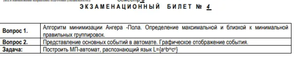

## Вопрос 1

Максимальная правильная группировка единственная и получается после применения алгоритма ангера-пола.

Кратчайшим (минимальным) называется правильное сохраняемое покрытие G = {Gi} (правильная замкнутая группировка) наименьшей мощности min G .

ПОСТРОЕНИЕ КРАТЧАЙШЕГО СОХРАНЯЕМОГО ПОКРЫТИЯ

на основе накопленного опыта и исследований, правдоподобным является предположение, что для массовых задач универсальных точных алгоритмов поиска кратчайшего покрытия не существует, но методы решения есть: последовательных сокращений, определения собственных покрытий, комбинаторный поиск в пространстве максимальных и не максимальных правильных группировок (покрытий). Все основаны на анализе множеств совместимости и множеств их непосредственно производных.

КОЛИЧЕСТВЕННАЯ ОЦЕНКА ДЛЯ КРАТЧАЙШЕГО ПОКРЫТИЯ 𝐺𝑚𝑖n

ЛЕММА 1.
Мощность максимальной правильной группировки (максимального
покрытия) не превышает мощности множества несовместимых состояний
(множества несовместимости): 𝐺𝑚𝑎𝑥 ≤ 𝐺incompability .

Лемма 2.
Мощность кратчайшего покрытия не превышает мощности
максимальной правильной замкнутой группировки: 𝐺𝑚𝑖𝑛 ≤ 𝐺𝑚𝑎x

Лемма 3.
Мощность кратчайшего сохраняемого правильного покрытия
𝐺𝑚𝑖𝑛 не менее мощности наибольшего независимого
множества 𝑃𝑚𝑎𝑥 графа совместимости :
𝑃𝑚𝑎𝑥 ≤ 𝐺𝑚𝑖n

## Вопрос 2

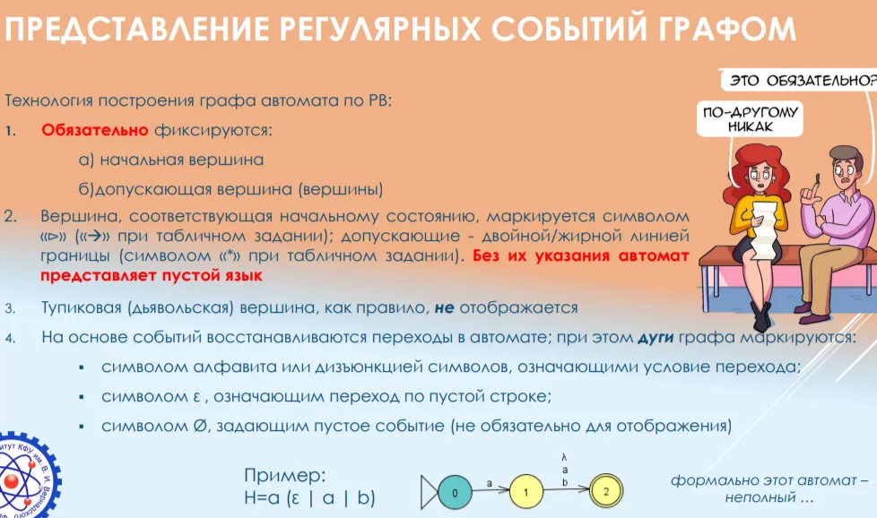

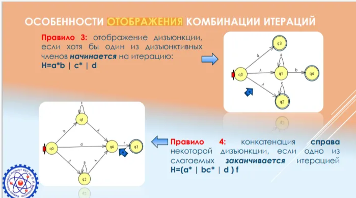

## Задача

#TODO: Ебануть пуш-даун автоматик

# Билет 5

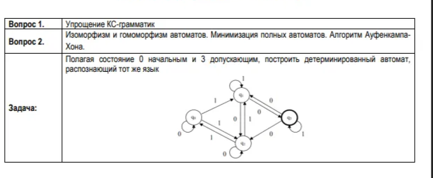

## Вопрос 1

Небольшой контекст

КС - САМЫЙ РАСПРОСТРАНЕННЫЙ ТИП ГРАММАТИК
• работа распознавателей в составе компиляторов сводится к построению в
том или ином виде дерева разбора входной цепочки
• затем это дерево разбора используется компилятором для синтеза
результирующего кода
т.е. класс вычислительной сложности задачи разбора - Р
Время, требуемое на разбор цепочки КС-языка, с ростом длины цепочки растет
полиномиально.
это задачи, решение которых можно получить за разумное время

Вследствие специфики КС-языков, часть задач принципиально алгоритмически неразрешимы:

1. Невозможно алгоритмически установить равенство двух языков;
2. Невозможно определить пересечение языков;
3. если пересечение КС-языков не пусто – невозможно определить является ли оно конечным
множеством, КС-языком или регулярным множеством;
4. Невозможно алгоритмически установить однозначность КС-грамматики;

================================================================

Это какой то пиздец, в прошлой лекции под упрощением имелось ввиду CYK, но и приведение грамматик может быть частью “упрощения”. Поэтому я наебашу вообще все.

================================================================

РАЗРЕШИМЫЕ ЗАДАЧИ

1. Приведение КС-грамматик к нормальной форме
2. Проверка принадлежности языку
3. Переход от КС-грамматики к МП-автомату
4. Переход от МП-автомата к КС-грамматике

ПРИВЕДЕНИЕ ГРАММАТИК

1. Удаление ε-продукции;
2. Удаление цепных продукций вида A → B с нетерминалами A и B;
3. Удаление бесполезных, бесплодных символов;
4. Избавление от прямой левой рекурсии;

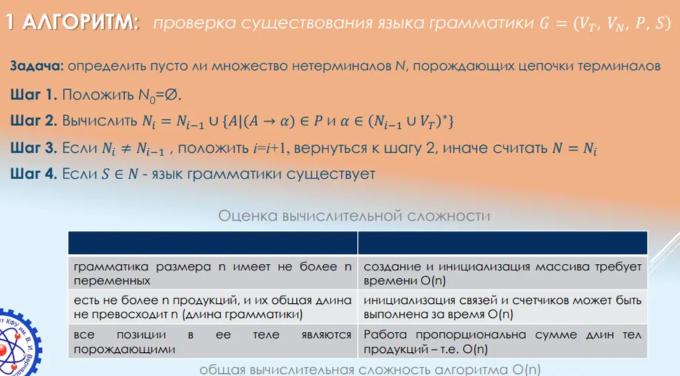

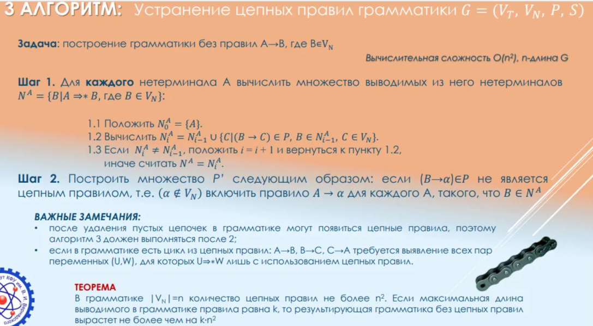

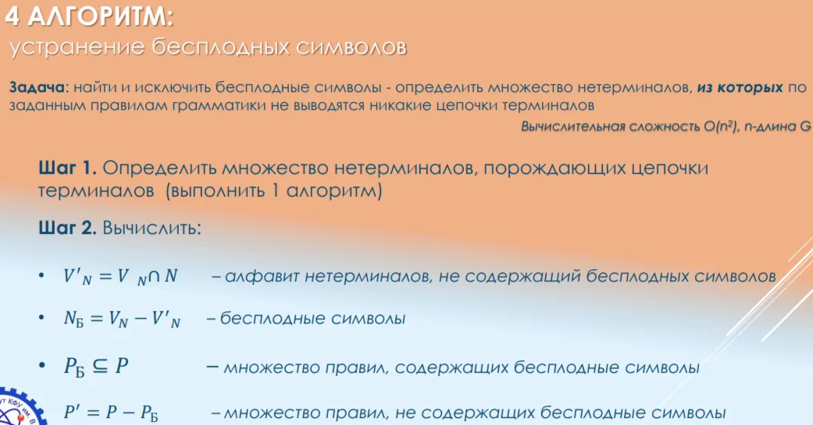

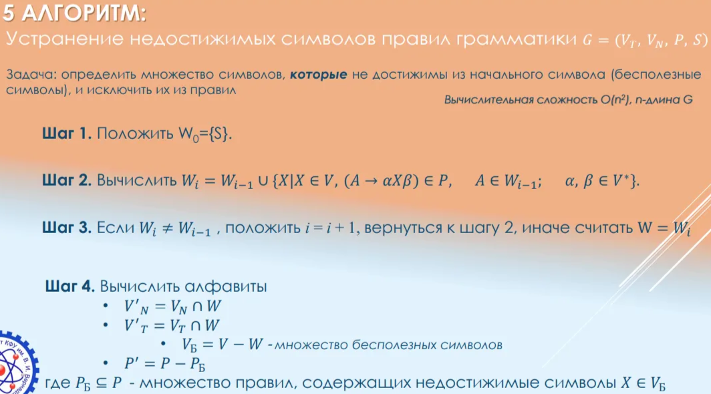

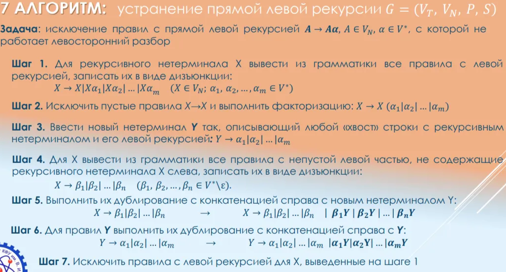

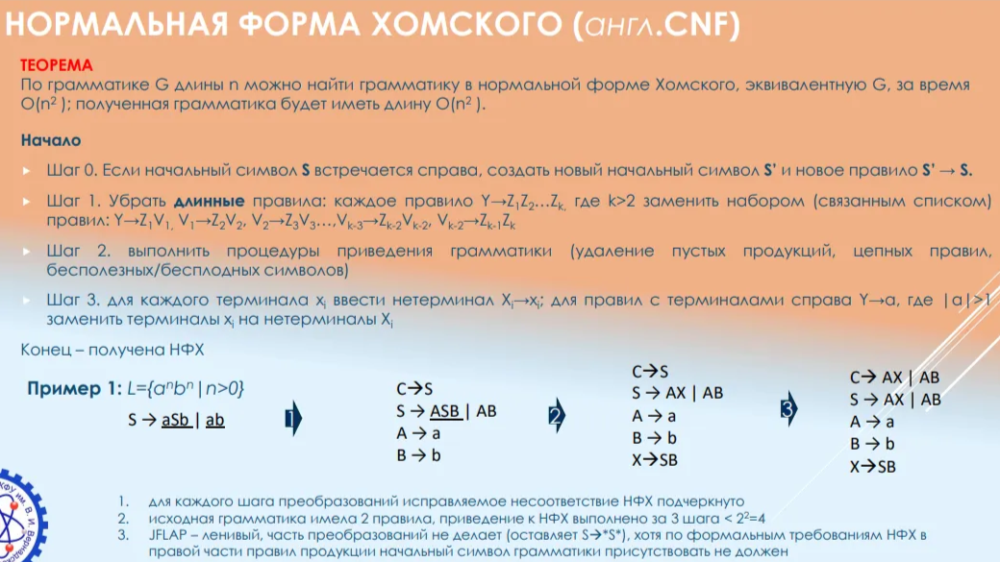

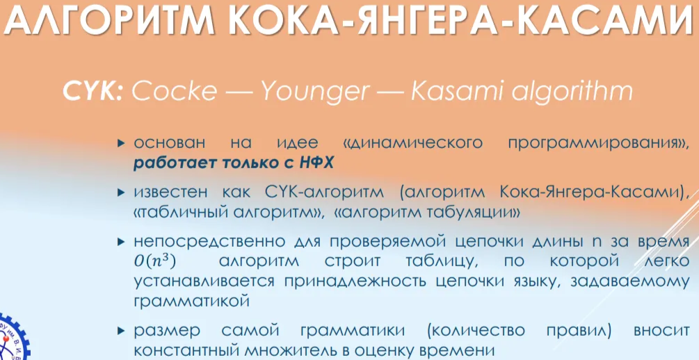

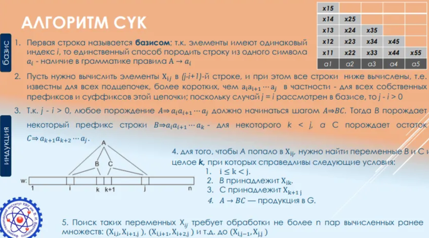

P.S Какой же пиздец

## Вопрос 2

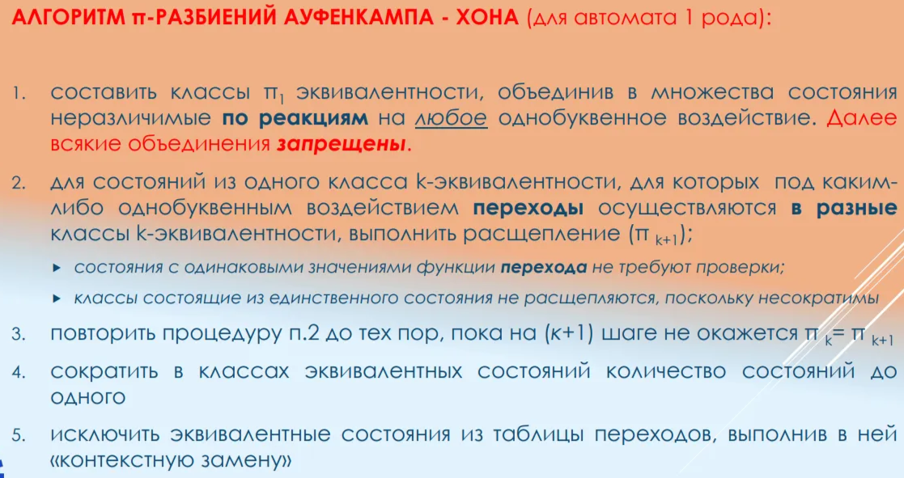

## Задача

#TODO: сделать нормально и проверить в jflap

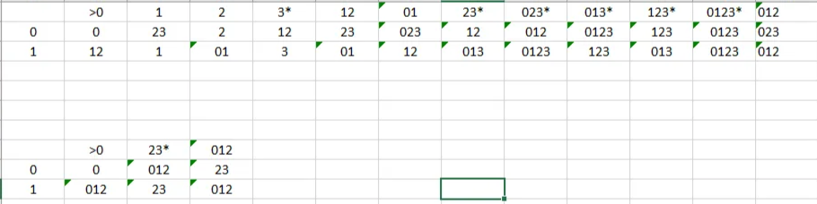

# Билет 6

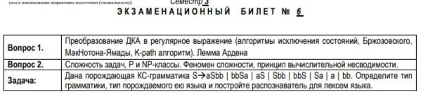

## Вопрос 1

ДКА → регулярочка

**Два метода и ручная хуйня:**

1. Ручной подбор регулярки, которая при преобразовании дает автомат, изоморфный исходному
2. Метод исключения состояний: переход к εНКА с одним начальным/одним допускающим состояниями и последовательное исключением промежуточных состояний.
3. Алгебраический метод Бжозовского

### **Метод исключения состояний**

идея метода заключается в построении **обобщенного НКА** с одним начальным и одним конечным состояниями и последовательном исключении состояний.

Выполняется последовательность действий, обратных процедуре разметки мест.

**ОНКА - обобщенный НКА,** он имеет единственные начальное и допускающее состояния, за шаг работы **может обрабатывать как отдельные символы, так и цепочки.**

Метод требует выполнения **следующих условий**:

- уникальности двух состояний:
    - начального, из которого достижимы все другие состояния автомата; оно недостижимо ни из каких других состояний (нет входящих дуг)
    - допускающего, из которого нет переходов (нет исходящих дуг);
    - допускающее состояние отличается от начального состояния
- все состояния, кроме начального и конечного, должны быть связаны переходами со всеми другими состояниями, при этом:
    - несуществующие переходы помечаются символом пустого множества (**∅)**
    - каждое состояние имеет переход само в себя: или под
    литералом (итерация), или - под λ / эпсилон

*Я ебал это парсить мозгом, оставлю это здесь*

Короче очевидная хуйня, если надо одну дугу сделать, то конкатенация всего промежуточного

*нихуя не понял (понял, очевидная хуйня №2):*

**Лютейшее summary:**

1. ДКА → НКА при помощи добавления новых начального и конечного состояния, сшитых спонтанными переходами, после этого все состояния исходного автомата рассматриваются как промежуточные, и считаются связанными со всеми другими маркированными дугами.
2. Удаление всех промежуточных состояний по одному, как делать есть выше
3. Процесс удаления продолжается до тех пор, пока в автомате не останется только одна пара из начального и конечного состоянй, добавленных на первом шаге.
4. Регулярка будет на этом единственном переходе между начальным и конечным состоянием.

Примеры посмотрите в презе 15 by parmenov

В кратце:

### Алгебраический метод Бржозовского (спасите)

УНИКАЛЬНЫЙ ПОДХОД К ГЕНЕРАЦИИ РЕГУЛЯРОК **(для ДКА)**!!!

На основе правил регулярной грамматики **для каждого состояния автомата формируется уравнение, называемое характеристическим**

Построение характеристических уравнений выполняется формальной **процедурой, аналогичной восстановлению правил правосторонней регулярной грамматики:**

1. каждому состоянию qi сопоставить некоторое событие Ri
2. для множества событий Ri составить систему уравнений:
    1. в левой части уравнения указывается это исходное событие Ri;
    2. в правой – дизъюнкция термов, где каждый дизъюнктивный член отражает
    правила праворекурсивной грамматики:
    ❖ **при переходе под действием символа «a» из qi в qj в левой части уравнения будет Ri, в правой части – aRj**
    ❖ формально a=0, если нет перехода от Ri к Rj (слагаемое не отображается)
    3. если Ri – конечное (допускающее) состояние, ε/λ также является одним из
    слагаемых правой части

Ключевую роль играет **лемма Ардена -** (цитата) 

Пусть P и Q два регулярных выражения. Если P≠λ, то уравнение R = Q + RP имеет
единственное решение R = Q{P}*

**Альтернативная формулировка:**

Уравнение вида X = AX + B, где A≠λ, имеет единственное решение X = {A}* B

Внезапно, вполне straightforward, вот еще примерчик

**Вычислительная сложность: $O(n^34^n)$**, где n – количество состояний автомата

## Вопрос 2

Слайдики не найдены, поэтому tldr:

P - задачи, решаемые за полиномиальное время. $O(n^2)$ напр.

NP - задачи, которые не могут быть гарантированно решены за полиномиальное время, к примеру - экспоненциальная сложность $O(3^n)$.

## Задача

Тип грамматики / языка - контекстно-свободная (тип 2)

Надо строить мп автоматик….

Могло быть людское, но теоретики опять все обосрали (преза 19, слайд 2):

# Билет 7

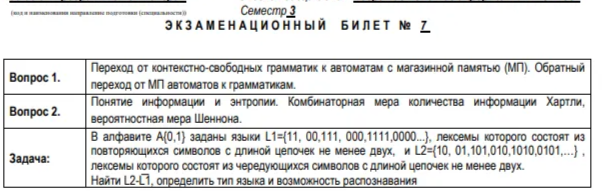

## Вопрос 1

Ура, снова МП автоматики!!

Переход от КС грамматики к автомату с магазинной памятью **возможен двумя способами:**

1. **Левосторонный разбор** - людской вариант, дает недетерминированный МПА если есть правила грамматики с выбором, из-за чего с точки зрения производительности посасывает.
2. **Правосторонний разбор** - петушиный, но по итогу более эффективный с точки зрения производительности.

### Левосторонний разбор

Одно состояние, допуск по опустошению магазина.

Для каждого правила вида A→β задать магазинную функцию, которая замещает нетерминал на вершине стека, соответствующий левой части правила грамматики, правой частью правила δ(𝑞, 𝜀, 𝐴) = (𝑞, 𝛽).

Для каждого терминала x задать магазинную функцию, которая выталкивает из стека символ, совпадающий с входным терминалом, с последующим переходом автомата к следующему символу цепочки δ(𝑞, 𝑥, 𝑥) = (𝑞, 𝜀). Т. е. правила, которые просто убирают терминалы из стека вместе со считыванием цепочки.

Изначально в магазин заносится начальный символ грамматики (т. е. в 99% случаев - S)

**Пример автомата после левостороннего разбора:**

### Правосторонний разбор

Бляяя пошло оно нахуй

## Вопрос 2

Чето там

## Задача

Чето там

# Билет 8

## Вопрос 1

Чето там

## Вопрос 2

Чето там

## Задача

Чето там

# Билет 9

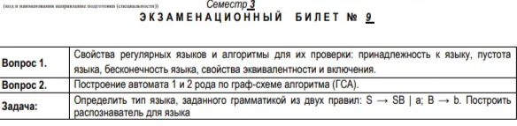

## Вопрос 1

Чето там

## Вопрос 2

Чето там

## Задача

Чето там

# Билет 10

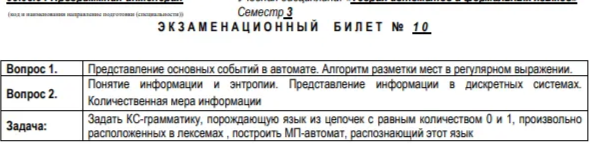

## Вопрос 1

Чето там

## Вопрос 2

Чето там

## Задача

Чето там

# Билет 11

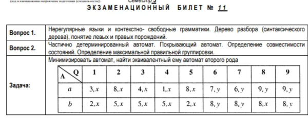

## Вопрос 1

Чето там

## Вопрос 2

Чето там

## Задача

Чето там

# Билет 12

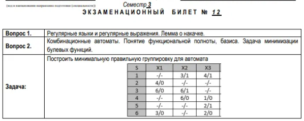

## Вопрос 1

Чето там

## Вопрос 2

Чето там

## Задача

Чето там

# Билет 13

## Вопрос 1

Чето там

## Вопрос 2

Чето там

## Задача

Чето там

# Билет 14

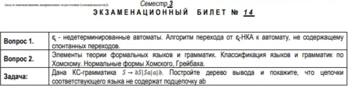

## Вопрос 1

Чето там

## Вопрос 2

Чето там

## Задача

Чето там

# Билет 15

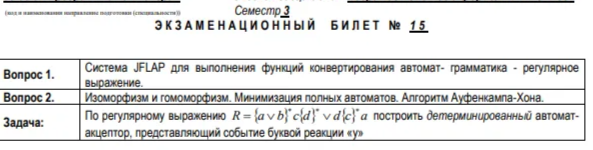

## Вопрос 1

Чето там

## Вопрос 2

Чето там

## Задача

Чето там

# Билет 16

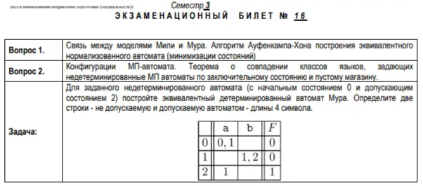

## Вопрос 1

Чето там

## Вопрос 2

Чето там

## Задача

Чето там

# Билет 17

## Вопрос 1

Чето там

## Вопрос 2

Чето там

## Задача

Чето там

# Билет 18

## Вопрос 1

Чето там

## Вопрос 2

Чето там

## Задача

Чето там

# Билет 19

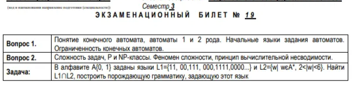

## Вопрос 1

Чето там

## Вопрос 2

Чето там

## Задача

Чето там

# Билет 20

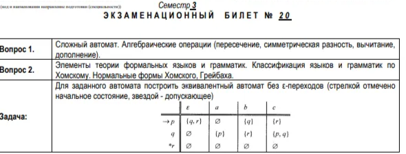

## Вопрос 1

Чето там

## Вопрос 2

Чето там

## Задача

Чето там

# Билет 21

## Вопрос 1

Чето там

## Вопрос 2

Чето там

## Задача

Чето там

обратных процедуре разметки мест